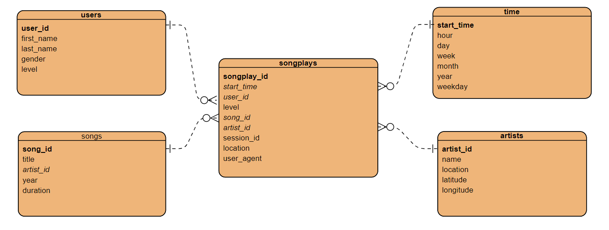
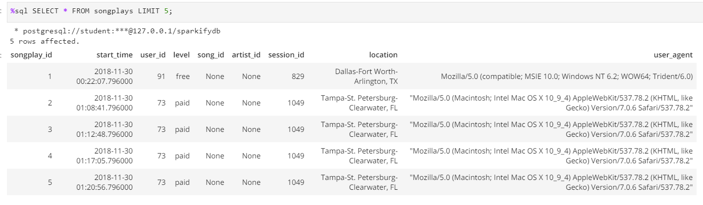
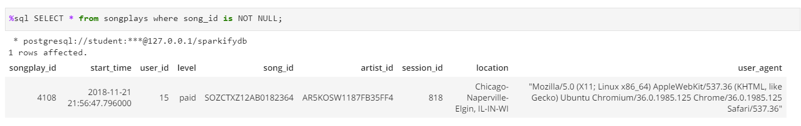
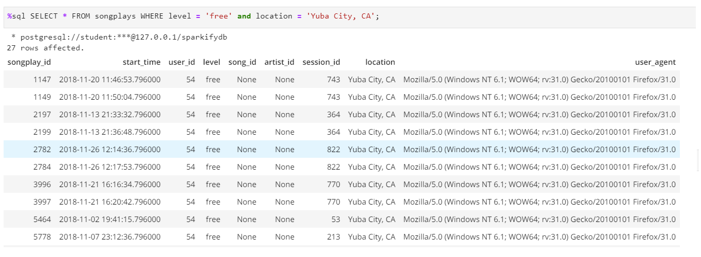

<h1 align="center">Data Modeling with Postgres</h1>


## Summary

A startup called Sparkify wants to analyze the data they've been collecting on songs and user activity on their new music streaming application. The analytics team is particularly interested in understanding what songs users are listening to. Currently, they don't have an easy way to query their data, which resides in a directory of JSON logs on user activity on the application, as well as a directory with JSON meta-data on the songs in their application.

They'd like a data engineer to create a Postgres database with tables designed to optimize queries on song play analysis. The role of this project is to create a database schema and ETL pipeline for this analysis.

## Project Description

In this project, we will model the data with Postgres and build an ETL pipeline using Python. The fact and dimension tables for a star database schema for a particular analytic focus is defined, and an ETL pipeline that transfers data from files in two local directories into these tables in Postgres using Python and SQL was developed.


## Dataset
#### Song Dataset
Songs dataset is a subset of [Million Song Dataset](http://millionsongdataset.com/).  Each file in the dataset is in JSON format and contains meta-data about a song and the artist of that song. The files are partitioned by the first three letters of each song's track ID. For example, here are filepaths to two files in this dataset.

```
song_data/A/B/C/TRABCEI128F424C983.json
song_data/A/A/B/TRAABJL12903CDCF1A.json
```


An example of what a single song file :
```
{"num_songs": 1, "artist_id": "ARJIE2Y1187B994AB7", "artist_latitude": null, "artist_longitude": null, "artist_location": "", "artist_name": "Line Renaud", "song_id": "SOUPIRU12A6D4FA1E1", "title": "Der Kleine Dompfaff", "duration": 152.92036, "year": 0}
```

#### Log Dataset
Logs dataset is generated by [Event Simulator](https://github.com/Interana/eventsim).  These log files in JSON format simulate activity logs from a music streaming application based on specified configurations.

The log files in the dataset you'll be working with are partitioned by year and month. For example, here are filepaths to two files in this dataset.
```
log_data/2018/11/2018-11-12-events.json
log_data/2018/11/2018-11-13-events.json
```

And below is an example of what the data in a log file, 2018-11-12-events.json, looks like.:


## Database Schema Design and ETL Pipeline

### Data Model

The database is designed using a **star schema** consisting of fact and dimension tables. There is one fact table (**songplays**) containing all the metrics associated with each event user's actions, and four dimensions tables, containing associated information such as **users, songs, artists** and **time**.

This model enables us to get value out of the data faster and easier since we don't need complex joins when querying data. Referential integrity is also enforced because each record in a dimension table has a unique primary key, and all keys in the fact tables are legitimate foreign keys drawn from the dimension tables.




## ETL pipeline
The ETL pipeline process both song and log dataset to insert into the fact and dimensional tables. While inserting, duplicate records for the same `user_id`, `song_id`, `artist_id` and `start_time` would be ignored. For those logs of which no related songs or artists found, no records would be inserted into songplays.

## Project structure

Files in this repository:

1. ` test.ipynb` displays the first few rows of each table to check the database.
2. `create_tables.py` drops and creates Sparkify database and tables.
3. `etl.ipynb` defines the ETL pipeline, which pulls and transforms the song and log JSON files in the local directory and inserts them into the Postgres database.
4. `etl.py` reads and processes files from song_data and log_data and loads them into your tables.
5. `sql_queries.py` defines the SQL queries that underpin the creation of the database schema and ETL pipeline
6. `data/` contains song and log files on user activity in JSON format


## Getting Started

### Prerequisites

* python
* jupyter notebook
* psycopg2 library from Python
* PostgreSQL

### How to run

Follow the steps to extract and load the data into the data model.

1. Execute `create_tables.py` to create/reset the tables

   ```python
   python create_tables.py
   ```

2. Execute ETL process and load data into database

   ```python
   python etl.py
   ```

3. Check whether the data has been loaded into database by executing queries in `test.ipynb`


> **Note:** You will not be able to run `test.ipynb`, `etl.ipynb`, or `etl.py` until you have run `create_tables.py` at least once to create the *sparkifydb* database, which these other files connect to. Make sure to close the connection or restart the notebook to avoid  multiple connections to the same database.

#### Example Query Results


1. `sql SELECT * FROM songplays LIMIT 5;`

 

2. `sql SELECT * from songplays where song_id is NOT NULL;`

  

  *Since this is a subset of the much larger dataset, the solution dataset will only have 1 row with values for value containing ID for both songid and artistid in the fact table. Those are the only 2 values that the query in the `sql_queries.py` will return that are not-NONE. The rest of the rows will have NONE values for those two variables(example1)*


3. `%sql SELECT * FROM songplays WHERE level = 'free' and location = 'Yuba City, CA';`

 